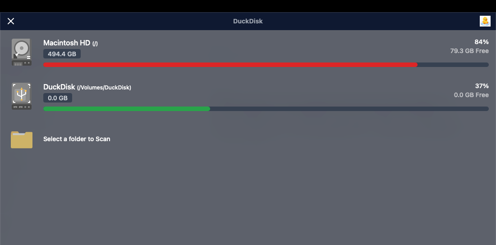
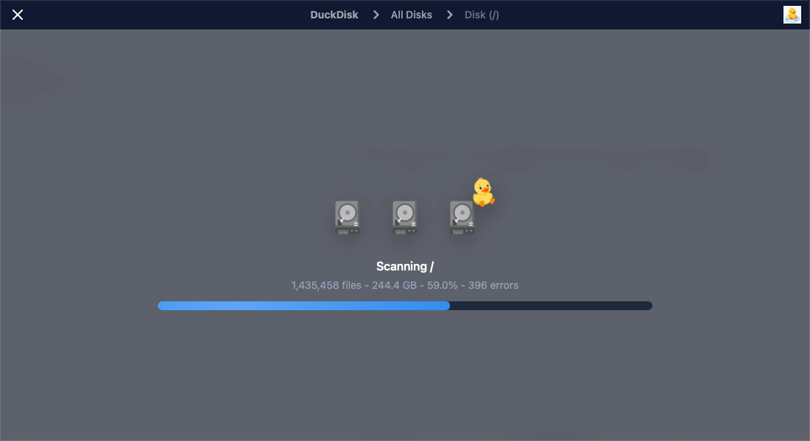
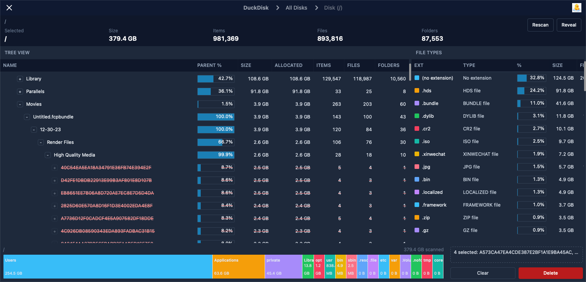

# DuckDisk

DuckDisk is a macOS disk usage analyzer by Qi Yang, inspired by WizTree-style workflows. It scans disks and folders, shows where space is going in dense tables, and lets you quickly reveal or delete large files from one place.

The app is built with Tauri, Rust, React, and the `pdu` scanner.

## Screenshots

### Disk List



### Scan Progress



### Scan Results



## Features

- Dense tree view with folder/file counts, sizes, allocated size, and parent percentage.
- Drag-to-delete function.
- File type summary with extension totals and percentages.
- Finder integration for revealing files and folders.

## Permissions

For accurate full-disk scans, grant DuckDisk Full Disk Access:

1. Open DuckDisk.
2. Click `Grant Full Disk Access`.
3. Enable DuckDisk in macOS Privacy & Security settings.
4. Restart DuckDisk and rescan.

If macOS prompts for permissions during a scan, denied or previously blocked reads may count as scan errors. After granting permissions, run `Rescan` for cleaner results.

## Installation

Download the `.dmg`, open it, and drag DuckDisk into Applications.

Local development builds are ad-hoc signed. On first launch, macOS may require right-clicking the app and choosing `Open`. For some new version of MacOS this may not work, then execute
`
xattr -dr com.apple.quarantine /Applications/DuckDisk.app
`

## Development

```bash
npm install
npm run build
npm run tauri build
```

The macOS installer is generated under:

```text
src-tauri/target/release/bundle/dmg/
```

For this project, final release DMGs are renamed with `arm64` rather than Tauri's default `aarch64` suffix.

## Notes

DuckDisk is focused on local macOS disk analysis. It does not currently implement true incremental rescanning; cached results are reused until `Rescan` is requested or a delete operation clears the cache.

## Acknowledgements

Thanks to the original SquirrelDisk author and contributors for the foundation this project builds on.
