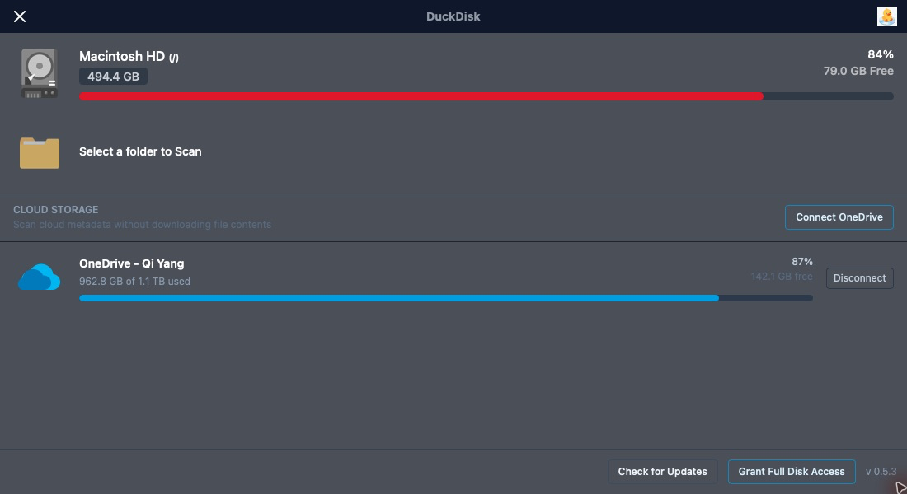
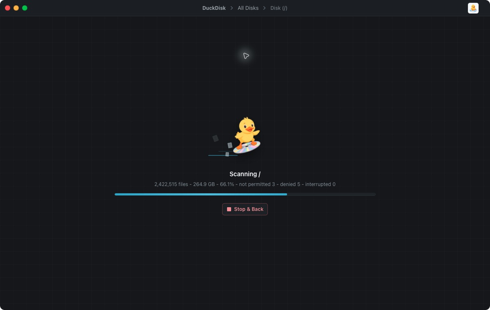
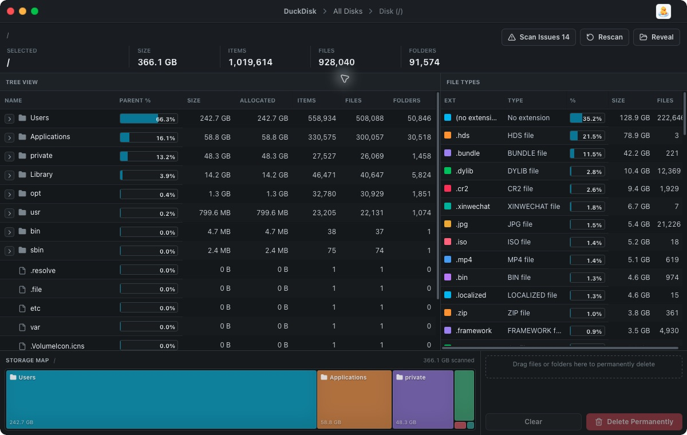

# DuckDisk

[](LICENSE)
[](https://github.com/qiyang77/duckdisk/releases)
[](https://qiyang77.github.io/duckdisk/)


**DuckDisk** is a macOS disk usage analyzer inspired by **WizTree-style** workflows. It scans disks and folders, shows where space is going in dense tables, and lets you quickly reveal or delete large files from one place.

The app is built with Tauri, Rust, React, and the `pdu` scanner.

Website: https://qiyang77.github.io/duckdisk/

## Screenshots

### Disk List



### Scan Progress



### Scan Results



## Features

- **Dense tree view** with folder/file counts, sizes, allocated size, and parent percentage.
- **OneDrive cloud scan** using file metadata only, without downloading file contents.
- Fast repeat OneDrive scans using Microsoft Graph delta updates.
- **Drag-to-delete** function.
- File type summary with extension totals and percentages.
- Finder integration for revealing files and folders.

## Permissions

For accurate full-disk scans, grant DuckDisk Full Disk Access:

1. Open DuckDisk.
2. Click `Grant Full Disk Access`.
3. Enable DuckDisk in macOS Privacy & Security settings.
4. Restart DuckDisk and rescan.

If macOS prompts for permissions during a scan, denied or previously blocked reads may count as scan errors. After granting permissions, run `Rescan` for cleaner results.

OneDrive scans use Microsoft account authorization and only request read access. Refresh tokens are stored in macOS Keychain; cached scan metadata is stored in DuckDisk's application cache.

## Installation

Download the `.dmg`, open it, and drag DuckDisk into Applications.

Local development builds are ad-hoc signed. On first launch, macOS may require right-clicking the app and choosing `Open`. For some new version of MacOS this may not work, then execute
`
xattr -dr com.apple.quarantine /Applications/DuckDisk.app
`

## Development

```bash
npm install
npm run build
npm run tauri build
```

### OneDrive development setup

Create a Microsoft Entra app registration for personal Microsoft accounts and work/school accounts:

1. Configure it as a public mobile/desktop client.
2. Add `http://localhost` as a redirect URI.
3. Add delegated Microsoft Graph permission `Files.Read`.
4. Do not create or embed a client secret.

Pass its Application (client) ID when running or building DuckDisk:

```bash
DUCKDISK_ONEDRIVE_CLIENT_ID=your-client-id npm run tauri dev
DUCKDISK_ONEDRIVE_CLIENT_ID=your-client-id npm run tauri build
```

For GitHub releases, set the repository Actions variable `ONEDRIVE_CLIENT_ID`.

The macOS installer is generated under:

```text
src-tauri/target/release/bundle/dmg/
```

## Acknowledgements

We thank SquirrelDisk (https://github.com/adileo/squirreldisk), whose work this project refers to.
